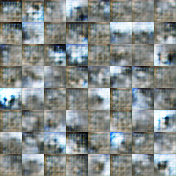
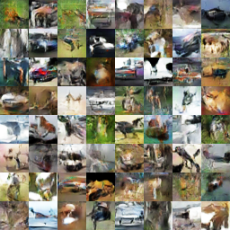
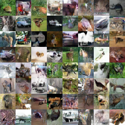
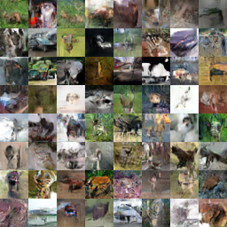
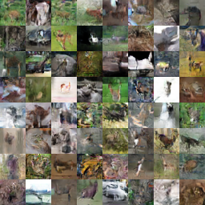

# DCGAN for CIFAR10


A clean implementation of DCGAN for CIFAR 10 from [Generative Adversarial Networks](https://arxiv.org/abs/1406.2661) in tensorflow 1.1

## PREREQUISITES
- Python 2.7
- Tensorflow 1.1
- numpy

## TRAINING
You have to download cifar10 into data folder 
```python
./download.sh
```
To train model 
```python
python cifar_gan.py
```

You can find generated images at out folder

## RESULTS
at 5 iters



at 85 iters



at 185 iters



at 285 iters



at 385 iters



You can see it begin with noise image at first iteration and will generate image more clearly but in the end, the model collapse happen, images are destroyed
 

